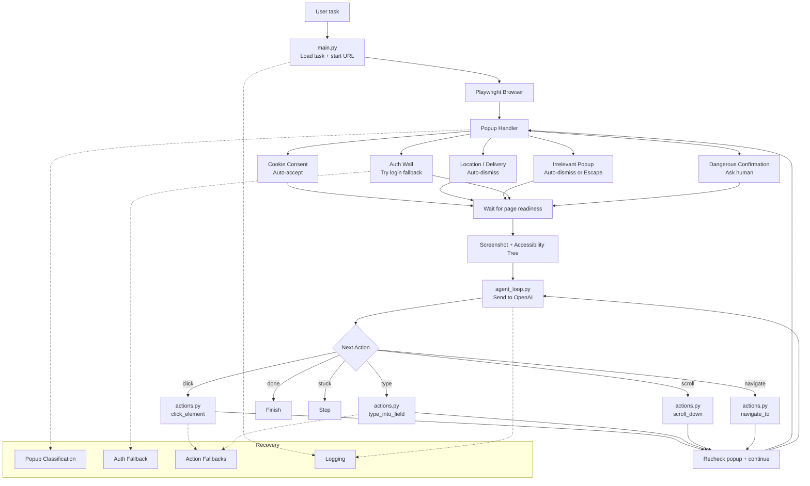

# Browser Automation Agent (VLM Support)
A robust browser automation agent powered by Vision-Language Models (VLM). This system intelligently navigates web pages, handles various types of popups, extracts page state, and makes decisions autonomously to complete user tasks.

# Browser Agent — Openai Vision + Playwright

A browser automation agent that uses Openai's vision capability to navigate 
live websites by reading screenshots and deciding actions — no CSS selectors, 
no brittle XPath, no hardcoded DOM queries.

Built as a companion demo for the tutorial:
**"Computer-use agents: building your first browser automation that doesn't break"**

---

## What This Is

Most browser automation breaks the moment a site updates its UI.
This agent doesn't use element selectors at all.

Instead, it works the way a human does:
- Takes a screenshot of the current browser state
- Sends it to Openai (vision model) with the task and action history
- Openai decides the next action based on what it actually sees
- The agent executes that action via Playwright
- Repeat until task complete

This makes it resilient to layout changes, redesigns, and dynamic content 
— at the cost of being slower and more expensive per action than a 
traditional Playwright script.

---

## The Three Failure Modes This Handles

### 1. Popup Interrupts
Cookie banners, modals, newsletter overlays, and permission dialogs 
appear between the agent's last screenshot and its next planned action.

A pre-flight popup check runs before the main loop and after every 
navigation. Popups are classified as dismissible, blocking (CAPTCHA), 
or auth-required — each class gets different handling.

### 2. Layout Shifts
Dynamic content, lazy-loaded images, React re-renders, and skeleton 
screens cause the page to change between navigation and screenshot.

A stabilisation wait runs after every page change: networkidle + 
domcontentloaded + a buffer wait until two consecutive screenshots 
are identical. Only then does the agent act.

### 3. Auth Walls
Session expiry, login redirects, and 2FA challenges block mid-task 
progress silently without clear errors.

A session guard checks the current URL after every navigation against 
known auth wall patterns. On detection it either re-authenticates 
from stored credentials, generates a TOTP code for 2FA, or hands off 
to a human with a clear explanation.

---

## The Confirmation Gate

Before any destructive browser action — form submissions, deletes, 
purchases, sends — the agent pauses and surfaces a plain-English summary 
to the terminal:

## Architecture Overview
The system flow relies on a central agent loop that continuously evaluates page state via Playwright, processes it through OpenAI, and executes necessary actions while handling popups and recovery fallbacks.

