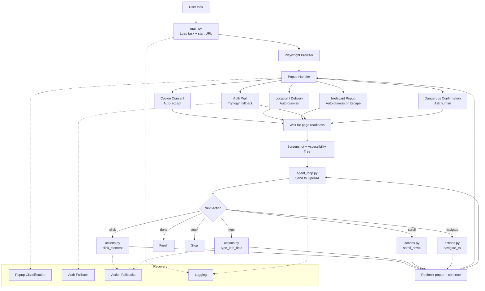

# Browser Automation Agent (VLM Support)
A robust browser automation agent powered by Vision-Language Models (VLM). This system intelligently navigates web pages, handles various types of popups, extracts page state, and makes decisions autonomously to complete user tasks.

## Architecture Overview
The system flow relies on a central agent loop that continuously evaluates page state via Playwright, processes it through OpenAI, and executes necessary actions while handling popups and recovery fallbacks.



## Getting Started & Initial Setup
If you are setting up this project and preparing to push it to the remote repository for the first time, follow the steps below.

### 1. Ensure Secrets are Ignored
Before running any git commands, make absolutely sure you have a `.gitignore` file set up so you don't accidentally push your virtual environment or `.env` files containing your OpenAI/Anthropic API keys.

If you don't have one yet, create a `.gitignore` file in your project folder and add these lines:

```gitignore
# .gitignore
venv/
__pycache__/
.env
logs/
screenshots/
```

### 2. Push to GitHub
Once your `.gitignore` is in place, open your terminal, ensure you are inside your local project folder, and run the following commands:

```bash
# 1. Initialize Git (If you haven't already)
git init

# 2. Stage and Commit Your Code
git add .
git commit -m "Initial commit: Browser automation agent with VLM support"

# 3. Rename the Default Branch to 'main'
git branch -M main

# 4. Link Your Local Repo to GitHub
git remote add origin https://github.com/Harsimran726/Browser-Automation-Agent.git

# 5. Push the Code
git push -u origin main
```
After this finishes loading, refresh your GitHub page, and your code and this README will be live.

For any future changes, you will only need to run:

```bash
git add .
git commit -m "Your update message"
git push
```
