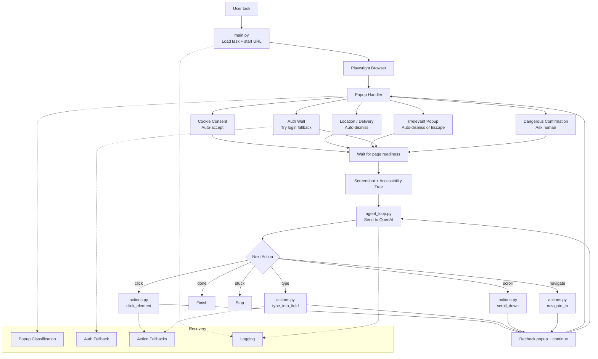

# Browser Automation Agent (VLM Support)
A robust browser automation agent powered by Vision-Language Models (VLM). This system intelligently navigates web pages, handles various types of popups, extracts page state, and makes decisions autonomously to complete user tasks.

## Architecture Overview
The system flow relies on a central agent loop that continuously evaluates page state via Playwright, processes it through OpenAI, and executes necessary actions while handling popups and recovery fallbacks.

